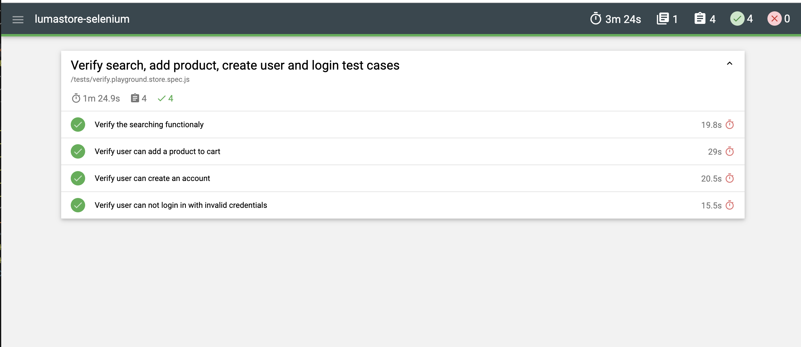

# ecommerce-playground-selenium

👋 Hello!

# Project description
This is a simple personal project used to demonstrate the author's skills in Seelenium + JavaScript testing automation.

Here we will apply the concepts of black box testing, where we will test the page https://ecommerce-playground.lambdatest.io/index.php?route=common/home. 

This project will cover the following aspects of the website:
- Search for a valid term in the top menu and check whether the results page loaded correctly;
- Add a product to the cart;
- Create user;
- Verify user is not able to login with invalid credentials.

# Language, framework and technologies used
Selenium framework was used in this project, and the test cases were created using the JavaScript language, in conjunction with the Page Objects project pattern. To better organize the test cases, it was used the mocha-selenium library. 

To make assertions, it was used the Chai assertion library. 

To generates the report, it was used the mochawesome reporting frameworking.

To generate user data, we used the API obtained from https://randomuser.me/, using the node-fetch library. 


# How to install and check the project?

After git clone this project to your local machine, access the project directory and do the following steps: 

1. **Install Selenium:**
```shell
npm install selenium-webdriver
``` 
2.  **Installs Mocha test framework** as a development dependency for your projec:

    `npm install mocha`

3. **Install Testing Framework:**

The "***npm install mocha***" command installs the Mocha test framework as a development dependency for your project. Mocha is a popular JavaScript test framework that is used to run automated tests for web applications.

The "***npm install mocha-selenium***" command installs the ***Mocha Selenium adapter*** as a development dependency for your project. The Mocha Selenium adapter is a library that allows you to run Selenium tests with Mocha. 

```shell
npm install mocha
```
```
npm install mocha-selenium
```

4. **Install Assertion Library:**
```shell
npm install chai
```

5. **Install Reporting Framework:**
```bash
npm install --save-dev mochawesome
```

6. **Install Node-Fetch Library:**
```bash
npm install node-fetch
```

7. **Run the test:**

    `npm test tests/verify.playground.store.spec.js`


# Test reports
Get location from the terminal window and open it in the brower, for example: 
```shell
[mochawesome] Report HTML saved to C:\_git_repos\selenium-mocha\mochawesome-report\mochawesome.html
```
## ...et voila!

